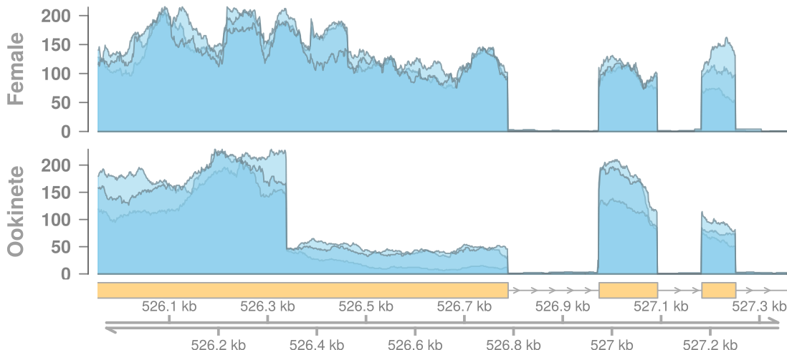
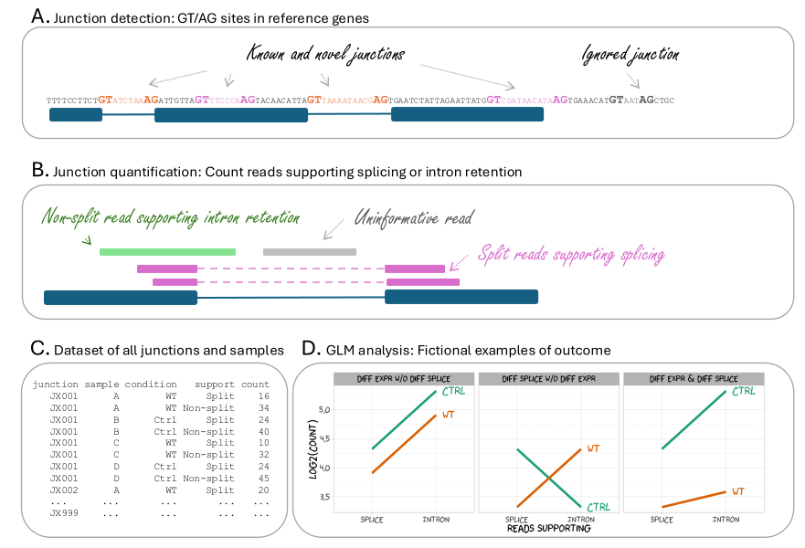

<!-- vim-markdown-toc GFM -->

* [Description](#description)
* [Set up environment](#set-up-environment)
* [Run pipeline](#run-pipeline)
    * [Relevant arguments](#relevant-arguments)
* [Output](#output)
* [Notes/TODO](#notestodo)
    * [02/09/2025 - featureCounts update](#02092025---featurecounts-update)

<!-- vim-markdown-toc -->

## Description

This workflow uses RNAseq data to identify *de novo* splicing sites, *i.e.*
splicing that may or may not correspond to known transcripts. `featureCounts`
is the workhorse behind this step. Then we the strategy for differential
methylation from [Chen *et al.*
2017](https://f1000research.com/articles/6-2055/v2) to assess differential
splicing across conditions.

Here's an example of differential splicing. The reference annotation reports
only the "Female" variant of the first exons. However, "Ookinetes" appear to
have this exon truncated early.



Note that this is different from differential transcript or differential exons
usage (as in *e.g.* the `DEXseq` method) in that we do not know beforehand where
splicing sites are. `De novo` transcript assembly using e.g.  `stringtie` is an
attractive option. However, stringtie performed very poorly in our hands in
*Plasmodium sp.* and de novo transcript assembly is not really what we want.




Outline of the differential splicing analysis: **A)** Testable splice junctions
are genomic intervals flanked by the canonical GT/AG sites; these junctions may
or may not correspond to reference introns, but they must overlap reference
genes. **B)** RNAseq reads split across junctions (purple) support splicing
while reads straddled across junctions support intron retention (green); reads
fully contained in introns, exons or intergenic regions are ignored. **C)** For
each junction and for each library, compile a table of counts supporting
splicing and intron retention. **D)** Differential splicing occurs when the
difference between split and non-split counts is different between conditions.

## Set up environment

Assuming you have conda installed and you also have
[mamba](https://github.com/mamba-org/mamba) installed (*e.g.* with `conda
install mamba -n base -c conda-forge`). Create a dedicated environment and
install dependencies:

```
conda create --yes -n splicenova
conda install -c conda-forge -c bioconda -n splicenova --yes --file requirements.txt
```

The name of the environment here is `splicenova` but any name you like will do.

## Run pipeline

Unless you have already done so, activate the environment:

```
conda activate splicenova
```

Run pipeline:

```
snakemake -p --dryrun --jobs 1 \
    --config fastqdir=$PWD/test \
             sample_sheet=$PWD/sample_sheet.tsv \
             species=$PWD/species.tsv \
             contrasts=$PWD/contrasts.tsv \
             max_intron_len=5000 \
             min_count=0 \
             min_pct_pass=0 \
    --directory output
```

This command with and without `--dryrun` option should run fine using the test
files included here. Remove `--dryrun` to actually execute the jobs. Results
will be in directory `output` but they will not be meaningful since this is
just a toy dataset.

------

### Relevant arguments

* `--jobs`: Number of jobs to run in parallel

* `--directory`: Write output to this directory

* `--dryrun`: Only show what would be executed. Remove this option for actual
  execution

Configuration options:

* `fastqdir`: Full path to the directory of the fastq files given in the sample
  sheet

* `sample_sheet`: Full path to the sample sheet. The sample sheet is a
  tab-separated file detailing the characteristics of the samples. The columns are:
    
    * `sample_id`: Name of the sample (any string you like but avoid using special characters)
    * `species`: Species identifier (any string you like but avoid using special characters)
    * `fastq_r1`: Name of first-in-pair fastq file
    * `fastq_r2`: Name of second-in-pair fastq file or NA if this is a single-end run
    * `strand`: The type of RNAseq library prep. Valid options are: RF (most
      common), FR, unstranded

* `species`: Full path to the file giving the download links of the reference
  genome(s). This a tab-delimited file with columns:

    * `species`: Species identifier (the same as in the sample_sheet)
    * `fasta`: Link to the reference genome
    * `gff`: Link to the annotation file in GFF format

* `contrasts`: Table of contrasts of interest. This file tells what groups of
  samples should be compared against each other. A tab-delimited file with
  columns:
    
    * `contrast`: Name of the contrast (any string you like)
    * `sample_id` Name of the sample as given in the sample_sheet
    * `side`: "lhs" or "rhs" (left-hand side, right-end side): Which samples
      should be grouped for comparison. E.g. for the contrast "Male vs Female"
      assign all male samples to lhs and all females to rhs. This will give the
      contrast "M - F".
    * `species`: Species identifier as given in the sample_sheet

* `max_intron_len`: Maximum expected length of the introns. ~5000 is about
  right for *Plasmodium* it doesn't need to be very accurate and probably
  better to make it slightly higher than reality (TODO: infer this from the GFF file)

* `min_count`: Minimum count of reads for a splice-junction to be considered. 0
  is mostly for testing better to use something like ~30 to exclude
  uninteresting junctions

* `min_pct_pass`: Percentage libraries passing count filtering. Again, 0 is
  mostly for testing probably choose something like 0.5

In all sample sheets the column names matter but the order of rows an columns
is not relevant and additional columns are ignored.

## Output

The most relevant output is under `<species>/edger`.

`differential_junctions.tsv.gz`: Table of differential splicing with columns:

* chrom
    Chromosome
* jx_start
    Start of the junction
* jx_end
    End of the junction
* gene_id
    Gene ID
* strand
    Strand of the gene
* contrast
    The conditions being compared as given in `contrasts.tsv`
* lhs
    Percent reads supporting splicing in left-hand side condition (lhs) as
    reportied in `contrasts.tsv`
* rhs
    Percent reads supporting splicing in right-hand side condition (lhs) as
    reportied in `contrasts.tsv`
* lhs_rhs_diff
    Difference lhs -rhs
* logFC
    Difference between conditions as log2-fold change. This is the usual
    metrics for quantifying differential expression but for differential
    splicing is not particularly intuitive. It is probably better to use the
    difference between `lhs` and `rhs`
* logCPM
    Overall expression  at the splicing site
* PValue
    Probability of obtaining a difference in splicing as large or larger than
    the observed under the null hypothesis that no differential splicing is
    present. This is a nominal, unadjusted Pvalue; consider using FDR for
    filtering and assessing the credibility of a differential splicing event
* FDR
    PValue adjusted corrected by False Discovery Rate. Typically, consider
    worth further investigation sites in the region of FDR < 0.01
* species
    Species
* description
    Gene description

Other output files should be self-explanatory (e.g. bigWig, BAM)

## Notes/TODO

### 02/09/2025 - featureCounts update

[featureCounts](https://subread.sourceforge.net/) has changed quite a bit from
v2.0.1 to v2.1.1 so this pipeline will not work with newer versions. From a
quick exploration, v2.0.1 and v2.1.1 give the same or similar results as far as
this pipeline is concerned, but the various changes break the code. An
(incomplete?) list of what needs to be updated:

* For paired-end input add `--countReadPairs` to commands

* Add `transcript_id` attribute to reference GFF using `scripts/addTranscriptId.py`

* The `<output-name>.jcounts` file has changed format
